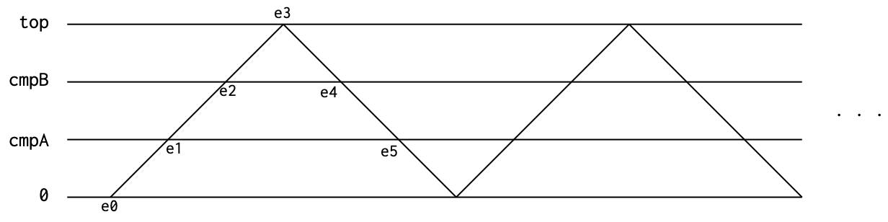

# EF_PWM32
A dual channel 32-bit PWM generator with a clock divider with support for both Edge and Center Alignment Modes.
## Description
The PWM module is capable of producing two PWM signals on pwmA and pwmB ports. The PWM signals are generated out of a 32-bit counter which is compared to the values cmpA and cmpB. The counter has two modes of operation:
- Mode 1 (Up/Down counting): from 0 to top then back to 0

- Mode 0 (Up counting): from 0 to top 

There 6 events (e0 to e5) while in mode 1. Four of these 6 events are available in mode 0. Each of the PWM ports can be configured to perform different actions at each one of the events. The actions are:
- Change to high
- Change to low
- Toggle/Invert
- No Change

## Clocking
There is a clock divider that can divide the system clock by 2, 4, 8 or 16. the output of this clock divider is used to clock the counter.

## Ports

| Port name  | Direction | Size   | Description |
| ---------- | --------- | ------ | ----------- |
| clk        | input     | 1       | Clock            |
| rst_n      | input     | 1       | Active low reset            |
| pwmA| output| 1|PWM Channel A out pins|
| pwmB| output| 1|PWM Channel B out pins|
| cmpA| input| 32|Channel A Compare |
| cmpB| input| 32|Channel B Compare |
| top| input| 32|Counter top value|
| clkdiv  |  input| 4  | Clock Divider:  - 0001 /2  - 0010 /4  - 0100 /8  - 1000 /16  |
| cntr_mode|input|1|  1 - up/down   0 - Down|
|enA|input|1| Channel A enable|
|enB|input|1| Channel B enable|
|en|input|1| PWM enable|
|invA|input|1| Invert channel A|
|invB|input|1| Invert channel B|
|pwmA_e0a|input|2| Channel A: Action* for Counter is 0 event|
|pwmA_e1a|input|2| Channel A: Action* for Counter is matching cmpA going up event|
|pwmA_e2a|input|2| Channel A: Action* for Counter is matching cmpB going up event| 
|pwmA_e3a|input|2| Channel A: Action* for Counter is matching top event|
|pwmA_e4a|input|2| Channel A: Action* for Counter is matching cmpB going down event|
|pwmA_e5a|input|2| Channel A: Action* for Counter is matching cmpA going down event|
|pwmB_e0a|input|2| Channel B: Action* for Counter is 0 event|
|pwmB_e1a|input|2| Channel B: Action* for Counter is matching cmpA going up event|
|pwmB_e2a|input|2| Channel B: Action* for Counter is matching cmpB going up event| 
|pwmB_e3a|input|2| Channel B: Action* for Counter is matching top event|
|pwmB_e4a|input|2| Channel B: Action* for Counter is matching cmpB going down event|
|pwmB_e5a|input|2| Channel B: Action* for Counter is matching cmpA going down event|

*00:none, 01:high, 10:low, 11:invert

## Bus Wrappers
AHB-Lite, APB and WB bus wrappers are provided.

### I/O Registers
| Register  | Size | Mode   | Offset | Reset Value |Description |
| ---------- | --------- | ------ | -- | ----| ----- |
| CMPA | 32 | RW | 0x00 | 0x00000000 | Compare A Register |
| CMPB | 32 | RW | 0x04 | 0x00000000 | Compare B Register |
| TOP | 32 | RW | 0x08 | 0x00000000 | Top Register |
| CLKDIV | 4 | RW | 0x0C | 0x00000000 | Clock Divider:  0001 /2  0010 /4  0100 /8  1000 /16 |
| CONTROL | 6 | RW | 0x10 | 0x00000000 | TControl Register:   0 : PWM Enable  1 : Channel A Enable  2 : Channel B enable  3 : Channel A Inversion  4 : Channel B Inversion  5: PWM counter mode (1:up/down, 0:Down)|
| GENA | 12 | RW | 0x14 | 0x00000000 | Gen A Action Register divided into six 2-bit fields to specify an action for the six possible events. The actions are: 00: no change, 01:high, 10:low, 11:invert.  1-0: e0 (counter is zero)  3-2: e1 (counter is matching CMPA; up counting)  5-4: e2 (counter is matching CMPB; upcounting)  7-6: e3 (counter is matchinp top)  9-8: e4 (counter is matching CMPB; down counting) 11-10: e5 (counter is matching CMPA; down counting )|
| GENB | 12 | RW | 0x18 | 0x00000000 | Gen B Action Register divided into six 2-bit fields to specify an action for the six possible events. The actions are: 00: no change, 01:high, 10:low, 11:invert.  1-0: e0 (counter is zero)  3-2: e1 (counter is matching CMPA; up counting)  5-4: e2 (counter is matching CMPB; upcounting)  7-6: e3 (counter is matchinp top)  9-8: e4 (counter is matching CMPB; down counting) 11-10: e5 (counter is matching CMPA; down counting )|

